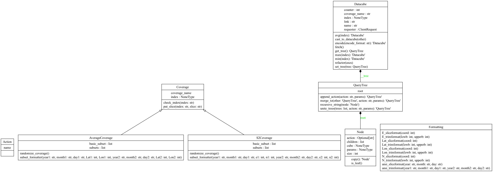

# Spatio-Temporal Datacubes: The OGC/ISO Coverage Standards

This repository contains the implementation of a Python library that allows us to iteract with the Rasdaman server via convenient API.

## Set Up

It is advisable to use Python virtual environment to contribute, build or test the project.
To create and activate the virtual environment from the existing one you can use these commands:

```python3 -m venv .venv ``` or ```python -m venv .venv ```

```source .venv/bin/activate ```

The list of dependencies can be found under ```requirements.txt```. 
The following command can be used to install all of them at once: 

``` pip install -r requirements.txt ```.

## Data

This project relies heavily on data, specifically on coverage data models. Accessing the datacubes is done via OGC WCS and WCPS standards. The coverages that we are going to use can be found here: https://standards.rasdaman.com/demo_wcs.html . Usually in this case, we have space/time datacubes, meaning that we have information about both dates and spatial coordinates, thus the representations could contain more axes.

Certain WCS (Web Coverage Service) and WCPS (Web Coverage Processing Service) requests require trimming the dataset, i.e. looking at subsets of the spatial information, and specific dates. In the case of slicing, one is interested in a lower-dimensional section of the datacube. We will be covering both of them in the project.

Data is retrieved from the Rasdaman server. Via http requests to the endpoint https://ows.rasdaman.org/rasdaman/ows , one can access a coverage description and check the axes that appear by pressing *Describe Coverage*. Accessing the *Get Coverage* page, one can choose their preferred method (slicing/trimming of the data) and enter allowed values in order to obtain a proper request URL. Our goal was to be able to use the data obtained in such manner and even perform queries on it.

For the purpose of storing and classifying the data, we will make use of the Datacube class and also of the Coverage class and its subclasses, which will help us navigate through different types of examples. Using classes like QueryTree we are also able to perform several actions on the given data and submit queries to the server.


## Features

- Lazy evaluation
    - Calculation will not be started until it is necessary for the user 
    - All actions are stored in an action tree until execution
- Action tree
    - Efficient tree-like data structure that allows to store various types of queries
    - Significantly reduces the amount of code
- Numerical queries (+,-,*,/)
    - This Python library is cabaple of operating with datacubes by summing, subtracting, dividing, multiplying
- Aggregation queries (min, max, avg)
    - This Python library is cabaple of operating with datacubes by aggregation functions like minimum, maximum and average
- Reshape query
    - This type of query allows to form a new datacube with new axes where values are datacubes that we have defined previously
- Linear memory and time consumption
    - With the help of the action tree, we can avoid copying redundant information in cases like "datacube+datacube"
    - With the help of efficient algorithms like DFS and efficient data structures like hash set we were able to obtain a linear complexity
- Random attribute generator
    - Method that generates values for coverage attributes, formatted for requests
    - Adds covenience for examples

## Examples of usage
Implementing our features, we were able to go through more examples as shown in this [Jupyter notebook](playground.ipynb).

## Code

Our contribution is organised into several folders and files, based on the role of the code. Here is an outline and short description on the content. Details about the features we implemented are presented as in-line documentation, i.e. in the code files.

- [```wdc```](wdc) - Source folder

    - [```__init__.py```](wdc/__init__.py) 

    - [```action.py```](wdc/action.py) - contains the enum class Action with all possible operations seen in queries (+, -, *, /, min, max, avg, encode, refactor, subindex).

  - [```datacube.py```](wdc/datacube.py)- contains the class Datacube (representation of datacubes in Rasdaman server) and its methods

  - [```connection```](wdc/connection)- Files relevant to the connection with the Rasdaman server
      - ```requester.py``` - contains the class ClientRequest which established a connection to the server and presents methods for requests.

    - [```coverage```](wdc/coverage) - Files that help understand and classify some coverages, that will provide convenient working with the coverages in the future
        - [```coverage.py```](wdc/coverage/coverage.py)- contains the class Coverage.
        - [```args_formatter```](wdc/coverage/args_formatter.py) - contains the class Formatting of static methods that create the specific format arguments to be passed further in the client requests, by taking "natural" parameters as input from the user (e.g. the date 01/01/2001 introduced as "01", "01", "2001" by user will be formatted into "ansi(\"2001-01-01\")").
        - [```subcoverages```](wdc/coverage/subcoverages/) - Folder containing a few inheritances of the Coverage class done by grouping some coverages from https://standards.rasdaman.com/demo_wcs.html by their descriptive subsets. All classes here contain a specific static method for randomly generating coverage attributes - we are taking into consideration the set of values that can be used for each axis trimming/slicing subset.
            - [```average_coverage.py```](wdc/coverage/subcoverages/average_coverage.py) - contains coverages described by the axes: ansi, Lat, Lon (i.e. 16 coverages with name "Average...", "Avg..."), which are of subtype "ReferenceableGridCoverage", as per the website.
            - [```s2_coverage.py```](wdc/coverage/subcoverages/s2_coverage.py) - contains coverages described by the axes: ansi, E, N (i.e. 6 coverages with name "S2_L2A_32631_..."), which are of subtype "RectifiedGridCoverage", as per the website.

  - [```tree```](wdc/tree) - This folder contains files that are useful for queries. The actions represented by the operations that need to be done in a client request query will be stored in the form of a tree. A query tree consists of nodes. A leaf node of the query tree is a datacube, and each operation will be stored in a non-leaf node. A query will be built via iterating in DFS order from the root to the leaves recursively.
      - [```__init__.py```](wdc/tree/__init__.py)
      - [```query_tree.py```](wdc/tree/query_tree.py) - contains the class QueryTree and its methods (appending new operations to the tree, merging query trees, etc.), and also the class Node for the nodes in the query tree.
      - [```tree_parser.py```](wdc/tree/tree_parser.py) - contains a function of iteration of a query tree and a function to generate new queries formated as wanted on the Rasdaman from a given query tree.
    

- [```tests```](tests) - Folder with tests for methods of main classes
    - [```args_formatter_test.py```](tests/args_formatter_test.py) - testcases for argument formatting functions
    - [```comparison_test.py```](tests/comparison_test.py) - testcases to compare datacubes from http requests with our datacubes
    - [```datacube_test.py```](tests/datacube_test.py) - testing actions on the datacube 
    - [```query_tree_test.py```](tests/query_tree_test.py) - testing functionality of the tree and process of combining actions
    - [```random_coverage_test.py```](tests/random_coverage_test.py)- testing randomizing coverage attributes by printing output
    - [```requester_test.py```](tests/requester_test.py)- testcases for defined requests
    - [```tree_parser_test.py```](tests/tree_parser_test.py) - testcases on different queries
    
    
- [```playground.ipynb```](playground.ipynb) - Jupyter Notebook containing examples

- [```requirements.txt```](requirements.txt) - Dependencies that need to be installed for the virtual environment

## UML diagram



## [Testing and test cases](tests)

## [Playground - demonstration and showcases](playground.ipynb)

## [Documentation](documentation/documentation.pdf)
+  Installation and detailed specification of the library and classes 
  
## Change log and implementation progress
### Sprint1
+ Date : 27 April 2024
+ Authors: Diana-Maria Harambas, Mark Kanafeev
+ Implementation Progress: 
  - Original authors of the design, codes, test and documentation

### Sprint2
+ Date : 7 May 2024
+ Authors: Zarina Abulkassova,  Daria Soloveva
+ Implementation Progress: 
  - Added document file 
  - Added args_formatter_test.py

### Sprint3
+ Date : 14 May 2024
+ Authors: Sulehri Sabeeh Ur Rehman, Wang Yat Sin
+ Implementation progress:
  - Amended [args_formatter.py](wdc/coverage/args_formatter.py) with format validation of date, latitude and longitude values.
  - Added test cases in [args_formatter_test.py](tests/args_formatter_test.py) for format validation of date, latitude and longitude values. 
  - Amended the in-line documentations in [sources](wdc) to enhance the readability
  - Enhanced the [Documentation](documentation/documentation.pdf) with coverpage, table of content, sections, formatting, class specification and testing. 
  - Added Document Change Log in the documentation and readme.md
  - Conducted a final review and edit of the codes and documentation for flawless release


